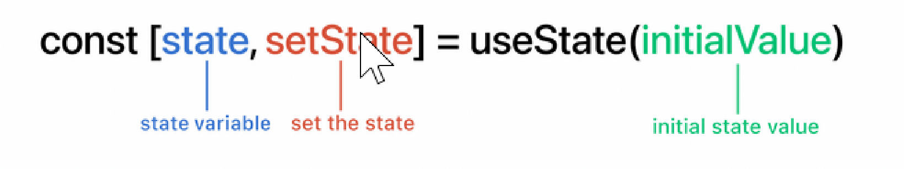

= Kahoot

I first want to know react, so I create the tic-tac-toe exercise
I didn't like this tutorial very much.
Constantly overwriting code makes it very complex for me.
Then I tried to make a quiz, based on a tutorial, but a lot of the components were made from before and not showed, so I had to start all over again...

== Theory
=== components

everything you build in React is a component.
By breaking down the UI into functional components, not oly does this bring logic and sense into the design process,
but it also makes manageable.
Components are reusable features that you can compose together to create a user interface (UI).
By modularizing features, your UI scales efficiently as your app grows.

==== Hierarchy of Components:
                   parent Component
                        data
 child component    child component     child component

A parent component will pass down data to nested child components using props.

Components are reusable features that you can compose together to create a user interface (UI).
By modularizing features, your UI scales efficiently as your app grows.

====  types of components

1. *Class Components*

Creating a class component involves sub-classing the Component class from the React library.

* the render Method describes what the component should look like when it renders on the page.
React takes the description and displays the result.
In particular, render returns a React element, which is a lightweight description of what to render.

* A component takes in parameters, called props (short for “properties”),
and returns a hierarchy of views to display via the render method.

* we use  JSX inhere:

https://reactjs.org/docs/introducing-jsx.html

JSX, asyntax extension to JavaScript, is recommended in React to describe what the UI should look like.
JSX may remind you of a template language, but it comes with the full power of JavaScript.

JSX produces React “elements”

Event-listeners in JSX: dragend, unload, pagehide, button, toggle, onClick, scroll, loadstart, dblclick, keydown, afterprint, ...)

NOTE: Since JSX is closer to JavaScript than to HTML, React DOM uses camelCase property naming convention
instead of HTML attribute names.
For example, class becomes className in JSX, and tabindex becomes tabIndex.

* Allow  you to declare local state properties.
** To “remember” things, components use state. React components can have state by setting this.state in their constructors.
this.state should be considered as private to a React component that it’s defined in.)
These properties declaratively describe what renders in the component's render method.
State should never be mutated directly and must always be updated using the setState function.
* Is the most fundamental form of component that you can build using React.
* Allows you to create and manage local state variables, such as the "inOn"
variable.

note: In JavaScript classes, you need to always call super when defining the constructor of a subclass.
All React component classes that have a constructor should start with a super(props) call.

 class Square extends React.Component {
        constructor(props) {
            super(props);
            this.state = {
              value: null,
            };
        }
 }

[start=2]
2. *Function Components*

* Functions Components are simple functions that return a JSX template.
* are simple and lightweight components for when you need to render visual elements
that depend mainly on props for their data
* by default, they do not implement local state and other features that you typically get with class Components.
* do not implement local state management => Hooks API is introduced.
This allows you to implement local state and this somewhere blurs the line between Class and Function components.

In React, function components are a simpler way to write components that only contain a render method
and don’t have their own state. Instead of defining a class which extends React.Component, we can write a function
that takes props as input and returns what should be rendered.
Function components are less tedious to write than classes, and many components can be expressed this way.

    function Square(props) {
    return (
     <button className="square" onClick={props.onClick}>
        {props.value}
     </button>
    );
    }

=== Hooks

A opt-in feature that lets you write 90% cleaner code using React hooks.
By simply importing the hook from the React library, you can manage your component's state
or other awesome features with only a few lines of code.

==== The 3 basic Hooks
* *useState*,
as the name says, is a hook that manages a component's state.
The useState consists of three parts: the state variable, the function to set the state, and the initial value.

 const [count, setCount] = useState(0)

* *useEffect*

 useEffect(didUpdate);

is a hook that manages the component's lifecycle.
It replaces the old ComponentDidMount, ComponentDidUpdate and ComponentWillUnmount, all in a few lines of code.
Mutations, subscriptions, timers, logging, and other side effects are not allowed inside the main body of
a function component (referred to as React’s render phase). Doing so will lead to confusing bugs and inconsistencies in the UI.

Instead, use useEffect. The function passed to useEffect will run after the render is committed to the screen.
Think of effects as an escape hatch from React’s purely functional world into the imperative world.

By default, effects run after every completed render, but you can choose to fire them only when certain values have changed.
Cleaning up an effect

Often, effects create resources that need to be cleaned up before the component leaves the screen, such as a subscription or timer ID.
To do this, the function passed to useEffect may return a clean-up function. For example, to create a subscription:

 useEffect(() => {
		document.title = `You clicked ${count} times.` // This is the mounting part
 }, [count]) // Add the count state in the array here (if you need it)

 seEffect(() => {
  const subscription = props.source.subscribe();
  return () => {
    // Clean up the subscription
    subscription.unsubscribe();
  };
});

* *useContext*

Accepts a context object (the value returned from React.createContext) and returns the current context value for that context.
The current context value is determined by the value prop of the nearest <MyContext.Provider> above
the calling component in the tree. When the nearest <MyContext.Provider> above the component updates,
this Hook will trigger a rerender with the latest context value passed to that MyContext provider.
Even if an ancestor uses React.memo or shouldComponentUpdate,
a rerender will still happen starting at the component itself using useContext.

!! Don’t forget that the argument to useContext must be the context object itself:

    Correct: useContext(MyContext)
    Incorrect: useContext(MyContext.Consumer)
    Incorrect: useContext(MyContext.Provider)

A component calling useContext will always re-render when the context value changes.
If re-rendering the component is expensive, you can optimize it by using memoization.

==== rules of Hooks (2)
React Hooks have a few set of rules that developers must follow.

* First rule: Only call Hooks at the top level

React Hooks cannot be called inside loops, conditions or nested functions.
They must be called at the top level of each of your components.

 useEffect(() => {
 if (name != "") {
 // Do something
 }
 }, [])

* Second rule: Only call Hooks from React functions

Hooks cannot be called in a class component, but only in a React function,
using the function keyword or creating a function with the arrow method:

 // Using function
 function MyComponent() {
 const [name, setName] = useState("Mary")
    // Some other code...
 }

 // Using the arrow method
 const MyComponent = () => {
 const [name, setName] = useState("Mary")
    // Some other code...
 }

=== new project
1.  To start a new React project, the easiest way is to type 'npx create-react-app nameOfProject' in  the terminal,
in the repository of your choice

I will create a file with some maps
- node_modules
- public      // is public to the browser
- index html
- ...
- src   // here comes the most code

* from inside the new project, you run 'npm start' to kick-start the development server.
* Delete everything in de app.js, so you can use it as the root of the application
(the file which is used by the webpack build system to travers the hierarchy of components that I'm going to build).

2. I made the components I need:
    - a Quiz component (the start page)
    - a QuestionComponent
    - a AnswerComponent
    - a ResultComponent
    - a textFieldComponent

[start=3]
3. Find out how to fetch :
https://designcode.io/react-hooks-handbook-fetch-data-from-an-api
 * Import useEffect

 const App = () => {
 useEffect(() => {
  }, []);
      return 

;
 };
export default App;

 * Define your URL

 useEffect(() => {
 const url = "https://api.adviceslip.com/advice"
 }, []);

* Create the asynchronous function

 const fetchData = async () => {
 try {
 const response = await fetch(url);
 const json = await response.json();
 console.log(json);
 } catch (error) {
 console.log("error", error);
 }
 };

 * put the fetchData function above in the useEffect hook and call it
useEffect(() => {
const url = "https://api.adviceslip.com/advice";

    const fetchData = async () => {
      try {
        const response = await fetch(url);
        const json = await response.json();
        console.log(json);
      } catch (error) {
        console.log("error", error);
      }
    };
    fetchData();
}, []);

[start=4]
4. loop through the result-array : https://bobbyhadz.com/blog/react-loop-through-array-of-objects

 return questions.length > 0 ? (
   

      {questions.map(question =>{
         return (
             

                  {question.question}
             

         )
      })}
   

)

{sp} +
{sp} +

NOTES:

* The 
 syntax is transformed at build time to React.createElement('div').

 return React.createElement('div', {className: 'shopping-list'},
   React.createElement('h1', /* ... h1 children ... */),
   React.createElement('ul', /* ... ul children ... */)
 );

* The DOM <button> element’s onClick attribute has a special meaning to React because it is a built-in component.
For custom components like Square, the naming is up to you.
We could give any name to the Square’s onClick prop or Board’s handleClick method, and the code would work the same.
In React, it’s conventional to use on[Event] names for props which represent events and handle[Event]
for the methods which handle the events.

===  Picking a Key

- When we render a list, React stores some information about each rendered list item.
When we update a list, React needs to determine what has changed.
We could have added, removed, re-arranged, or updated the list’s items.

- When a list is re-rendered, React takes each list item’s key and searches the previous list’s items for a matching key.
If the current list has a key that didn’t exist before, React creates a component.
If the current list is missing a key that existed in the previous list, React destroys the previous component.
If two keys match, the corresponding component is moved. Keys tell React about the identity of each component
which allows React to maintain state between re-renders.
If a component’s key changes, the component will be destroyed and re-created with a new state.

- Key is a special and reserved property in React (along with ref, a more advanced feature).
When an element is created, React extracts the key property and stores the key directly on the returned element.
Even though key may look like it belongs in props, key cannot be referenced using this.props.key.
React automatically uses key to decide which components to update.
A component cannot inquire about its key.

- If no key is specified, React will present a warning and use the array index as a key by default.
Using the array index as a key is problematic when trying to re-order a list’s items or inserting/removing list items.
Explicitly passing key={i} silences the warning but has the same problems as
array indices and is not recommended in most cases.

- Keys do not need to be globally unique; they only need to be unique between components and their siblings

I didn't like the tutorial of the tic-tac-toe gema, so I watched another tutorial: https://www.youtube.com/watch?v=kVeOpcw4GWY

